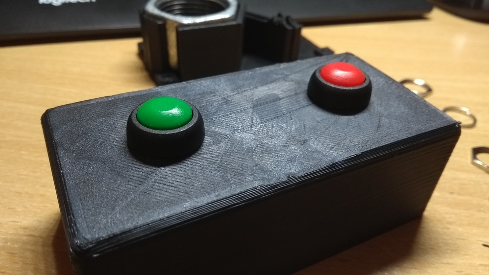

# Stacja Ateizm Pacyfikator

### About

A handy 3CX call controller made for the YouTube channel [Stacja Ateizm](https://www.youtube.com/channel/UCf-7NgaRNxxHCQrroBQH9pQ)

- Green button mutes the caller (This requires a running autohotkey instance). 
- Red button hangs up the phone (3CX shortcut).

### Firmware description
- Software debouncing made with the [Bounce](https://playground.arduino.cc/Code/Bounce) library
- Keyboard support handled with [Arduino Keyboard](https://www.arduino.cc/reference/en/language/functions/usb/keyboard/)
### Hardware description
- Arduino Pro Micro (Atmega32U4)
  - Provides native USB support.
  - Small form factor
  - External connection is enabled by an additional female USB type B socket mounted in the enclosure.  
- SPST switches
  - Need to be quite sturdy. My friend picked them though. These are doorbell switches if I recall correctly.
- 3D printed enclosure
  - black PLA, but any stiff material will be fine 
  - 0.2mm layer height
  - 40% infill
  - 0.8mm shell thickness with alternating extra wall
  - 0.4mm nozzle
- A heavyweight, hexagonal, metal nut, to make the device heavier.

